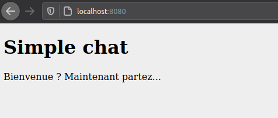

# Mon petit système de messagerie instantannée



## Fonctionnalités existantes

* Structure de la page de messagerie
* lorsque je saisis un message, il apparait dans la liste

## Fonctionnalités en cours

* Définir une structure JS pour gérer tous les messages/utilisateurs/conversations, etc.
* Récupérer la liste des utilisateurs en BDD et les afficher proprement dans la page

## Structure des données

### Utilisateurs

A l'heure actuelle, nos utilisateurs sont une simple chaine de caractère. Cela évoluera certainement.

### Messages

Un message est composé de :

- le message écrit
- un auteur
- une date (optionnel)

```json
{
    "contenu": "Bonjour monde",
    "auteur": "Bobbu",
    "date": Date.now()
}
```

## Quick start

* git clone
* créer un fichier `backend/db.php`

  ```php
    <?php

    $url = '';
    $user = '';
    $pass = '';
  ```

Configurer Apache (ou Nginx) et PHP puis vous pouvez accéder au chat.
